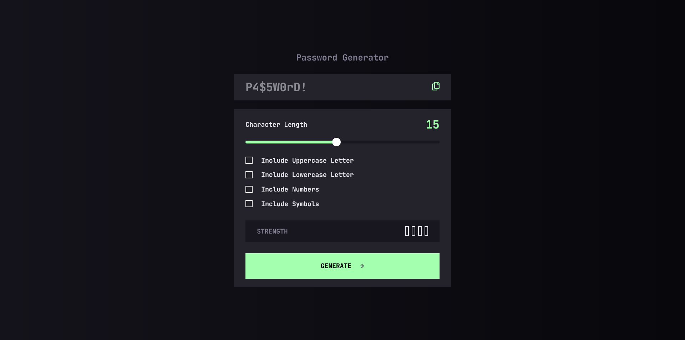
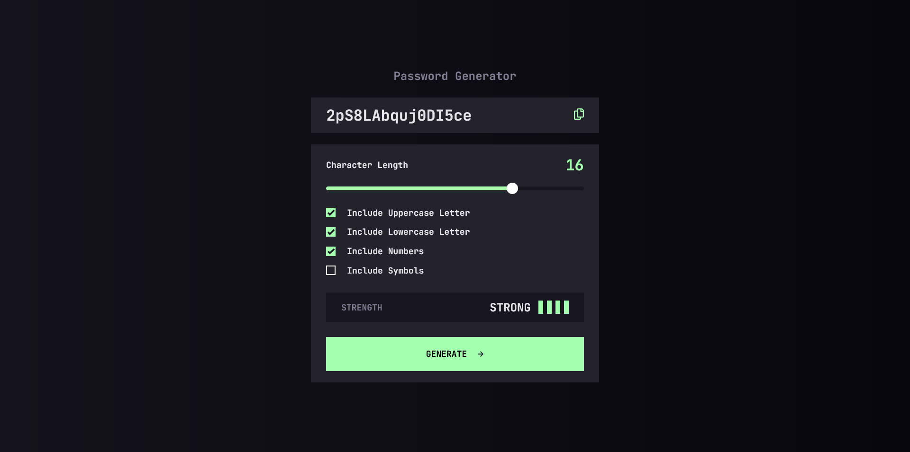
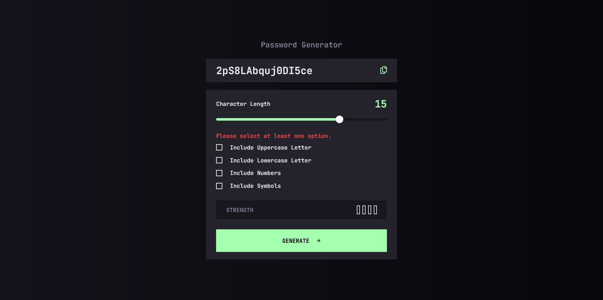

# Frontend Mentor - Password generator app solution

This is a solution to the [Password generator app challenge on Frontend Mentor](https://www.frontendmentor.io/challenges/password-generator-app-Mr8CLycqjh). Frontend Mentor challenges help you improve your coding skills by building realistic projects. 

## Table of contents

- [Overview](#overview)
  - [The challenge](#the-challenge)
  - [Screenshot](#screenshot)
  - [Links](#links)
  - [Built with](#built-with)
  - [What I learned](#what-i-learned)
- [Author](#author)

## Overview

This project is a simple password generator app that allows you to generate password based on the selected options. It also have the functionality to evaluate the password generated and allow you to copy the password to clipboard to copy the password generated with ease. I have used HTML, Sass, BEM and JavaScript to build this project.

### The challenge

Users should be able to:

- Generate a password based on the selected inclusion options
- Copy the generated password to the computer's clipboard
- See a strength rating for their generated password
- View the optimal layout for the interface depending on their device's screen size
- See hover and focus states for all interactive elements on the page

### Screenshot

Empty State:



Filled State:



Error State:



### Links

- Solution URL: [https://www.frontendmentor.io/solutions/simple-password-generator-app-using-html-sass-bem-and-javascript-652f2zgODQ](https://www.frontendmentor.io/solutions/simple-password-generator-app-using-html-sass-bem-and-javascript-652f2zgODQ)
- Live Site URL: [https://schindlerdumagat.github.io/password-generator-app/](https://schindlerdumagat.github.io/password-generator-app/)

### Built with

- Semantic HTML5 markup
- CSS custom properties
- Flexbox
- CSS Grid
- Mobile-first workflow
- [Sass](https://sass-lang.com/) - CSS preprocessor
- [BEM](https://nextjs.org/) - Block, Element, Modifier


### What I learned

I learned how to use and customize sliders based on functionality and design. I practiced using AI to solve problems without relying too much on it. I practiced organizing my codebase by functionality to make it more readable and maintainable.

```scss
// Custom checkbox styling
// sass/components/_checkbox.scss

.custom-checkbox {
  display: inline-flex;
  align-items: center;
  cursor: pointer;
  position: relative;

  & input[type="checkbox"] {
    display: none;
  }

  & .checkbox-box {
    width: 20px;
    height: 20px;
    border: 2px solid white;
    background-color: transparent; /* Inherit container bg if needed */
    display: inline-block;
    position: relative;
    transition: border-color 0.2s, background-color 0.2s;
  }

  &:hover input[type="checkbox"]:not(:checked) + .checkbox-box {
    border-color: var(--clr-green);
  }

  & input[type="checkbox"]:checked + .checkbox-box {
    background-color: var(--clr-green);
    border-color: var(--clr-green);
  }

  & input[type="checkbox"]:checked + .checkbox-box::after {
    content: "";
    position: absolute;
    top: 1px;
    left: 1px;
    width: 16px;
    height: 16px;
    background: url("../assets/images/icon-check.svg") no-repeat center
      center;
    background-size: contain;
  }

  .checkbox-label {
    font: inherit;
    margin-inline-start: clamp(
      var(--space-200),
      0.5229rem + 2.0356vw,
      var(--space-300)
    );
  }
}

// Custom slider styling
// sass/components/_slider.scss

.custom-range {
  -webkit-appearance: none;
  appearance: none;
  width: 100%;
  height: 8px;
  border-radius: 4px;
  background: linear-gradient(
    to right,
    var(--clr-green) 50%,
    var(--clr-grey-850) 50%
  );
  outline: none;
  cursor: pointer;
  transition: background 0.3s ease;
}

/* Track - Chrome */
.custom-range::-webkit-slider-runnable-track {
  height: 8px;
  background: transparent;
  border-radius: 4px;
}

/* Thumb - Chrome */
.custom-range::-webkit-slider-thumb {
  -webkit-appearance: none;
  height: 20px;
  width: 20px;
  border-radius: 50%;
  background: white;
  border: 2px solid transparent;
  transition: background 0.3s, border-color 0.3s;
  margin-top: -6px; /* Center thumb */
}

.custom-range:hover::-webkit-slider-thumb {
  background: var(--clr-grey-850);
  border-color: var(--clr-green);
}

/* Track - Firefox */
.custom-range::-moz-range-track {
  height: 8px;
  background: var(--clr-grey-850);
  border-radius: 4px;
}

/* Progress (left side) - Firefox */
.custom-range::-moz-range-progress {
  height: 8px;
  background: var(--clr-green);
  border-radius: 4px;
}

/* Thumb - Firefox */
.custom-range::-moz-range-thumb {
  height: 20px;
  width: 20px;
  border-radius: 50%;
  background: white;
  border: 2px solid transparent;
  transition: background 0.3s, border-color 0.3s;
}

.custom-range:hover::-moz-range-thumb {
  background: var(--clr-grey-850);
  border-color: var(--clr-green);
}
```

```js
// Logic to update custom slider's color
function updateRangeBackground() {
  const min = parseInt(range.min);
  const max = parseInt(range.max);
  const val = parseInt(range.value);
  const percent = ((val - min) / (max - min)) * 100;
  range.style.background = `linear-gradient(to right, #A4FFAF ${percent}%, #18171F ${percent}%)`;
}
```

## Author

- Website - [Schindler Dumagat](https://schindlerdumagat.github.io/webportfolio/)
- Frontend Mentor - [@schindlerdumagat](https://www.frontendmentor.io/profile/schindlerdumagat)
- LinkedIn - [@schindlerdumagat](https://www.linkedin.com/in/schindler-dumagat-015238230/)
